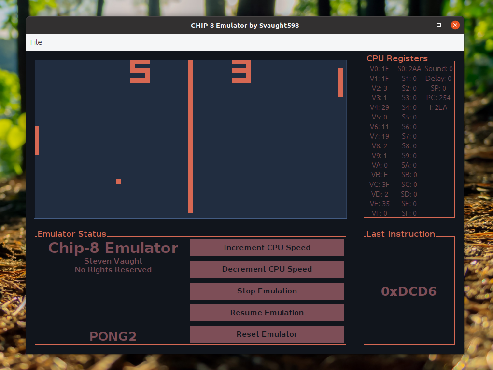

# Chip-8 Emulator

Just a CHIP-8 Emulator! Built with Java & Swing, project undertaken to learn about system emulation.

# Motivation

Since I found out about system emulation, I have been super fascinated with it. I'm building this CHIP-8 emulator to get started since the EmuDev community tends to suggest it for first-timers. My goal is to build a GB emulator, so this project is a sort of stepping stone.

# Technology Used

- Java
- Maven
- JUnit 

# Features

The goal is to be fully compatible with all known implementations of CHIP-8 instructions (using a menu with different "Modes"). Right now, the emulator is incomplete, but the current feature list is:

- Debug UI (to monitor registers, stack, timers, counters, etc...)
- Variable CPU clock speed
- Pause/Resume/Reset Emulation
- Load Roms from File

# Testing

Since most of the application is GUI, unit tests have only been written for the CPU. There are a number of test roms to facilitate debugging, so the unit tests weren't super rigorous; the test roms are included in the roms folder.

# Installation

Coming soon!

# Contributing

Coming soon!

# License

MIT License